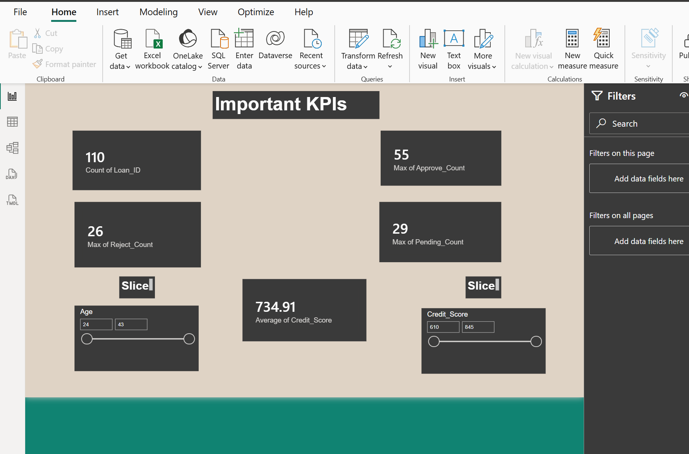
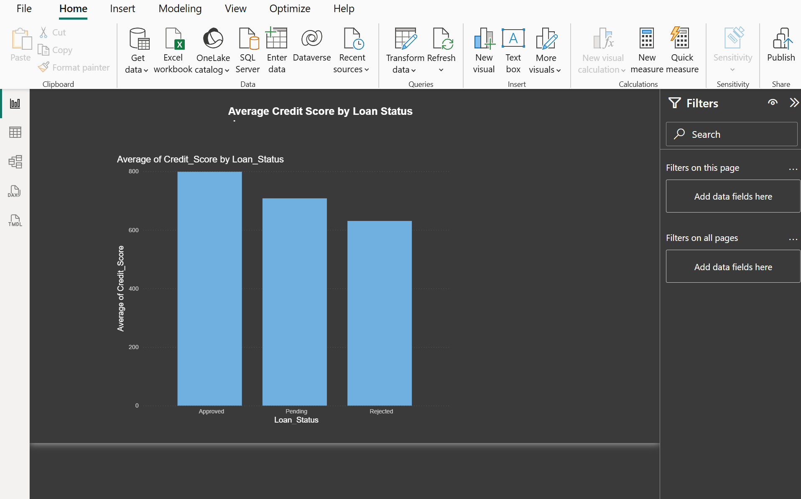

# 📊 Power BI Dashboard – Loan Portfolio Analysis

An interactive Power BI dashboard designed to analyze loan portfolio performance, borrower risk profiles, and key lending metrics. The dashboard enables data-driven decision-making through dynamic visualizations and KPI tracking.

---

## 📌 Project Overview

This Power BI dashboard provides insights into loan performance, credit risk, and borrower behavior by visualizing key financial metrics and trends.

The dashboard helps financial institutions and analysts:

- Monitor loan portfolio health
- Analyze borrower creditworthiness
- Track loan approval and status distribution
- Evaluate debt-to-income ratios
- Identify high-risk loan segments
- Support data-driven lending decisions

---

## 🛠️ Tools & Technologies

- **Power BI Desktop**
- **Data Modeling**
- **DAX (Data Analysis Expressions)**
- **Interactive Visualizations**
- **Financial Data Analysis**

---

## 📈 Key Dashboard Features

### ✅ Loan Portfolio Overview
- Total loan applications
- Total funded amount
- Total repayments received
- Portfolio performance summary

### ✅ Risk Analysis
- Borrower risk level segmentation
- High, Medium, and Low-risk categorization
- Risk distribution insights

### ✅ Loan Status Analysis
- Approved loans
- Rejected loans
- Pending applications
- Status-wise loan distribution

### ✅ Credit Score Analysis
- Average credit score monitoring
- Borrower creditworthiness evaluation
- Credit quality assessment

### ✅ EMI Ratio Analysis
- Debt-to-Income (EMI) ratio insights
- Borrower repayment capacity analysis
- Financial risk evaluation

---

## 📸 Dashboard Screenshots

### Full Dashboard


### Key Performance Indicators (KPIs)



### Loan Status Analysis


### Risk Level Analysis


### Average Credit Score



### EMI Ratio Analysis


---

## 🎯 Business Benefits

- Improved loan portfolio monitoring
- Better credit risk assessment
- Faster decision-making
- Enhanced reporting and analytics
- Identification of high-risk borrowers
- Improved lending strategy

---

## 📂 Repository Contents

```text
Power-BI-Dashboard/
│
├── DASHBORAD.FULL.png
├── KPIs.png
├── LOANSTATUS.png
├── RISKLEVEL.png
├── AVERAGECREDITSCORE.png
├── EMIRATIO.png
└── README.md
```

---

## 🚀 How to Use

1. Download the Power BI dashboard file.
2. Open it using Power BI Desktop.
3. Refresh the dataset if required.
4. Explore interactive visualizations and filters.
5. Analyze key loan portfolio metrics and trends.

---

## 👩‍💼 Author

**Divyani Kaushal**

MBA (Finance) | Data Analytics & Business Intelligence Enthusiast

GitHub: https://github.com/divyanikaushal02-cmd

---

⭐ If you found this project useful, consider giving it a star.
